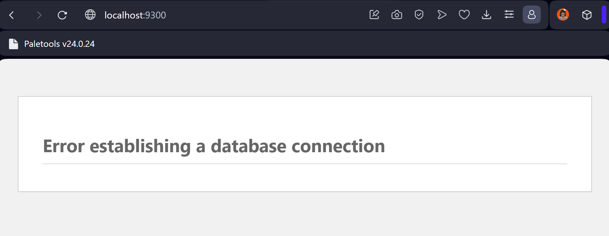

## Esquema para el ejercicio


### Crear la red
```
docker network create net-wp
```
### Crear el contenedor mysql a partir de la imagen mysql:8, configurar las variables de entorno necesarias
```
docker run --name SQL --network net-wp -e MYSQL_ROOT_PASSWORD=rootpassword -e MYSQL_DATABASE=wordpress -e MYSQL_USER=wordpressuser -e MYSQL_PASSWORD=wordpresspassword -d mysql:8
```

### Crear el contenedor wordpress a partir de la imagen: wordpress, configurar las variables de entorno necesarias
```
docker run --name wordpress-container --network net-wp -e WORDPRESS_DB_HOST=mysql-container:3306 -e WORDPRESS_DB_USER=wordpressuser -e WORDPRESS_DB_PASSWORD=wordpresspassword -e WORDPRESS_DB_NAME=wordpress -p 9300:80 wordpress
```

De acuerdo con el trabajo realizado, en la el esquema de ejercicio el puerto a es 9300

Ingresar desde el navegador al wordpress y finalizar la configuración de instalación.


Desde el panel de admin: cambiar el tema y crear una nueva publicación.
Ingresar a: http://localhost:9300/ 
recordar que a es el puerto que usó para el mapeo con wordpress


### Eliminar el contenedor wordpress
```
docker rm -f wordpress-container
```
### Crear nuevamente el contenedor wordpress
Ingresar a: http://localhost:9300/ 
recordar que a es el puerto que usó para el mapeo con wordpress

### ¿Qué ha sucedido, qué puede observar?

Se puede ver el mensaje "Error establishing a database connection". Esto ocurre porque al eliminar el contenedor de WordPress, también se elimina de la red tipo bridge donde se encuentra el contenedor de MySQL. Como resultado, no se puede establecer la conexión entre ellos.


